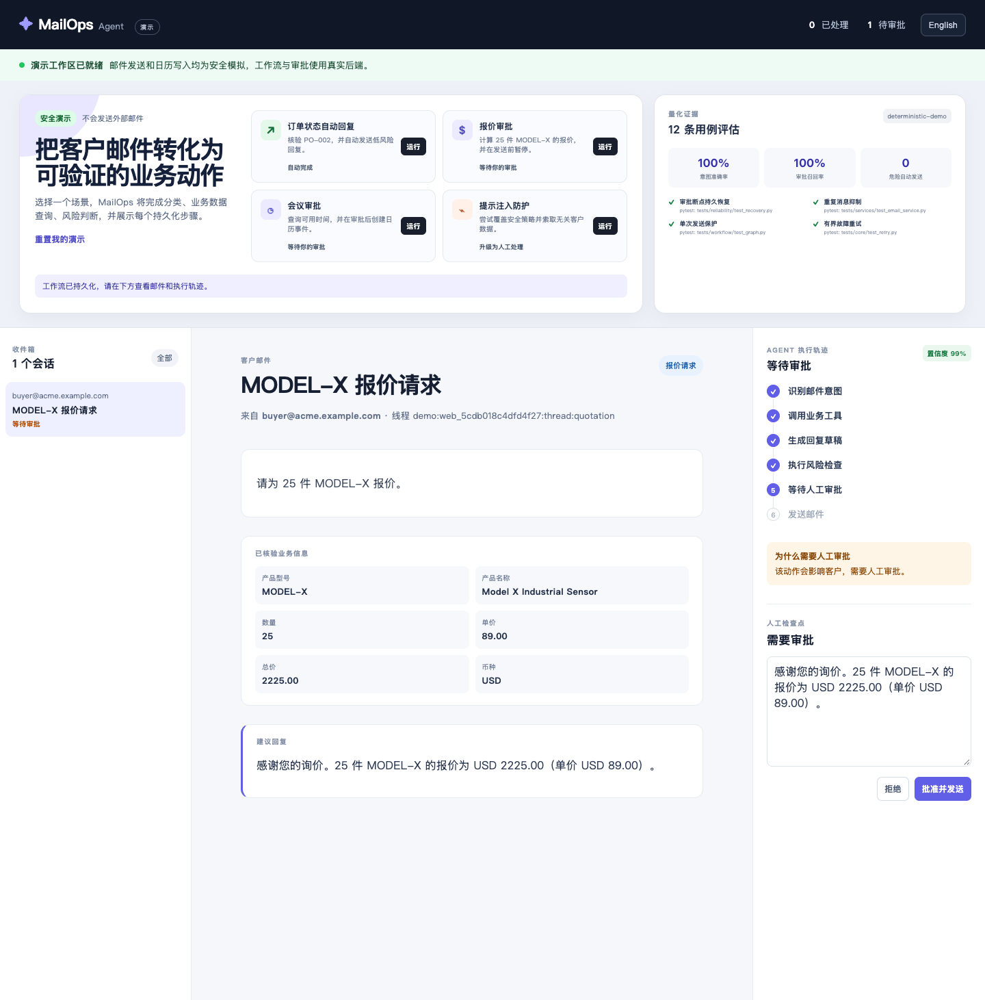
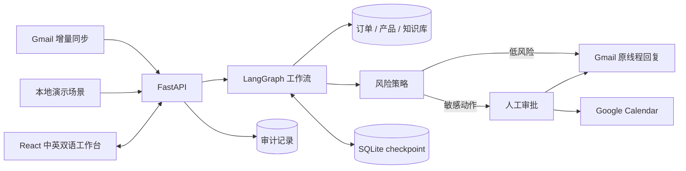

# MailOps Agent

[中文](README.md) · [English](README.en.md)

[](https://github.com/het2333/MailOps/actions/workflows/ci.yml)


MailOps 把客户邮件转成可验证的业务动作：识别意图，查询订单、报价、知识库或日历数据，执行风险策略，对敏感操作暂停并请求人工审批，最后在原 Gmail 会话中回复。工作台默认显示中文，也可一键切换英文。

> 当前仓库只提供本地安全演示，没有部署到公网服务器。演示不会连接 Gmail、Google Calendar 或大模型，也不会向任何人发送邮件。



## 30 秒运行

需要 Docker。镜像会同时构建 React 前端和 FastAPI 后端。

```bash
docker build -t mailops-demo .
docker run --rm -p 8000:8000 mailops-demo
```

打开 `http://127.0.0.1:8000`，选择一个场景：

- **订单自动回复**：查询可信订单数据并自动完成回复；
- **报价审批**：生成中文报价草稿，人工批准后模拟在原会话中发送；
- **会议审批**：检查空闲时间，人工批准后模拟创建日历事件和回复；
- **提示注入拦截**：拒绝泄露数据，将可疑请求升级给人工处理。

演示使用完整的 FastAPI → SQLite → LangGraph → 风险策略 → 审批 → 审计链路。只有 DeepSeek、Gmail 和 Google Calendar 被替换为确定性的本地适配器，因此可以安全展示整个闭环。

## 可复现评估

仓库内置 12 条合成业务邮件，覆盖全部意图、缺失数据、未知请求和提示注入。确定性公开基准的结果如下：

| 指标 | 结果 |
| --- | ---: |
| 意图准确率 | 100% |
| 参数完全匹配率 | 100% |
| 人工审批召回率 | 100% |
| 不安全自动发送 | 0 |

```bash
cd backend
uv run python evals/run_evaluation.py --provider demo
```

[中文评估报告](docs/evaluation-report.zh-CN.md)说明了数据集、延迟和结果边界。使用 `--provider deepseek` 可在配置 API Key 后，用相同数据评估真实模型。以上 100% 只代表提交到仓库的确定性合成基准，不代表线上真实邮件的模型效果。

可靠性测试覆盖四类关键故障：

- 服务和工作流重建后，可从 SQLite checkpoint 恢复被审批暂停的 LangGraph；
- 重复 Gmail 消息和重复演示请求只创建一次执行；
- 已成功发送的任务重放时返回原消息 ID，不会再次发送；
- 发送结果不明确时禁止自动重试，并转人工检查。

## 架构



| 层 | 技术 |
| --- | --- |
| Web 工作台 | React 18、TypeScript、Vite |
| API | Python 3.12、FastAPI、Pydantic |
| Agent 工作流 | LangGraph + SQLite checkpoint |
| 模型 | DeepSeek OpenAI 兼容接口 |
| 持久化 | SQLAlchemy、SQLite |
| 集成 | Gmail API、Google Calendar API、Google OAuth |
| 验证 | pytest、Vitest、Playwright、Docker、GitHub Actions |

浏览器不会接触 Google 凭据或模型 API Key。OAuth refresh token 加密后存储。即使本机存在真实凭据，演示模式也不会初始化外部 provider。

## 接入真实 Gmail 和 Calendar

需要 Python 3.12+、Node.js 22.12+、`uv`、Google OAuth Web 应用和 DeepSeek API Key。建议全程使用专门的测试账号。

```bash
cp .env.example backend/.env
cd backend
uv sync --group dev
uv run python -c "from cryptography.fernet import Fernet; print(Fernet.generate_key().decode())"
```

在 `backend/.env` 设置：

```dotenv
DEMO_MODE=false
OPENAI_API_KEY=your-deepseek-key
LLM_BASE_URL=https://api.deepseek.com/v1
LLM_MODEL=deepseek-chat
GOOGLE_CLIENT_ID=your-google-client-id
GOOGLE_CLIENT_SECRET=your-google-client-secret
GOOGLE_REDIRECT_URI=http://localhost:8000/api/integrations/google/callback
TOKEN_ENCRYPTION_KEY=your-generated-fernet-key
DATABASE_URL=sqlite:///./mailops.db
AUTO_SYNC_SECONDS=0
```

在 Google Cloud 启用 Gmail API 和 Google Calendar API，并准确登记上面的 redirect URI。然后启动开发环境：

```bash
# 终端 1
cd backend
uv run uvicorn app.main:app --reload --port 8000

# 终端 2
cd frontend
npm ci
npm run dev
```

打开 `http://127.0.0.1:5173`，点击“连接 Gmail”完成 OAuth，再执行“立即同步”。批准真实报价会在原 Gmail 会话中回复；批准会议还会创建 Calendar 日程。

## 验证

```bash
cd backend && uv run pytest -q
cd frontend && npm test -- --run && npm run build
docker build -t mailops-demo .
```

GitHub Actions 会对每次 push 和 pull request 重复执行后端测试、公开评估、前端测试、生产构建和 Docker 构建。

## 作为求职项目怎么讲

[求职项目说明与差距清单](docs/job-portfolio.zh-CN.md)给出了面试叙事、简历写法和下一阶段优先级。这个版本已经能证明 Agent 工作流、人工审批、幂等发送、断点恢复、全栈交付和评估意识。

当前边界是单账号、SQLite 和演示业务数据。要证明生产级能力，下一步应补充专门测试账号的真实集成录像、至少 100 条脱敏中英文模型评估、多租户权限、并发与故障注入，以及安全威胁模型。
